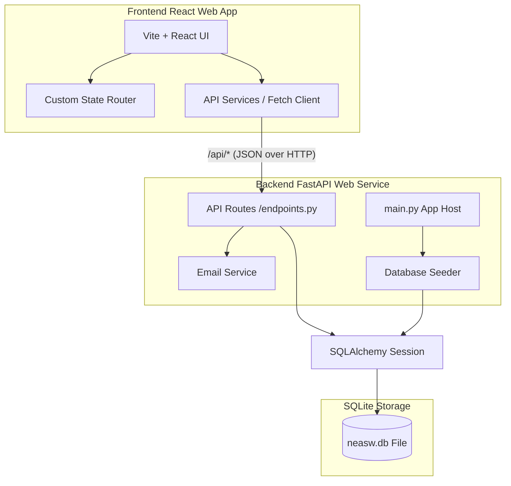
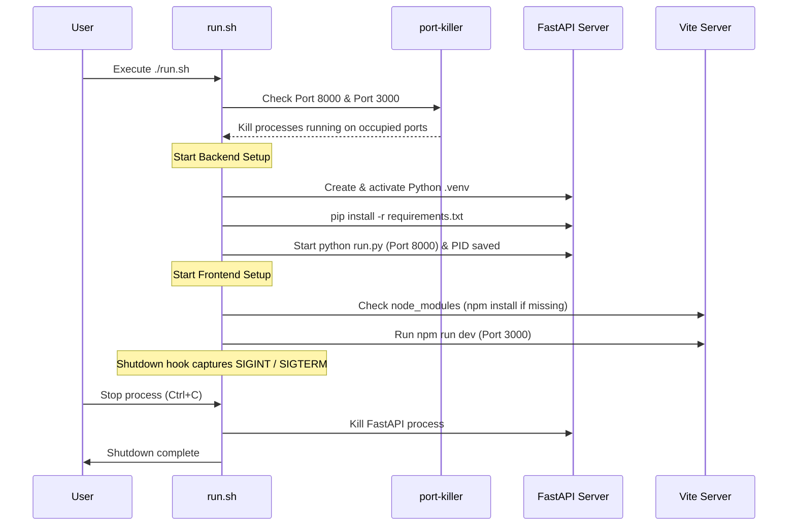

# NEASW Welfare Foundation Web App — Technical Documentation

This document provides a comprehensive technical overview of the **NEASW Welfare Foundation** web application. The platform is designed to promote community development, cultural preservation, sustainable tourism, and organic products from Northeast India.

The application leverages a modern, decoupled architecture:
*   **Backend:** FastAPI (Python) web API layer, backed by SQLite (SQLAlchemy ORM).
*   **Frontend:** React (TypeScript) + Vite single-page application, styled with custom premium CSS.
*   **Startup & Dev Orchestration:** An automated launch script (`run.sh`) that manages ports, environments, and servers.

---

## 🏗️ High-Level System Architecture



### Decoupled Operations
1.  **Client-Side Rendering:** The React application is loaded into the client browser as a Single Page Application (SPA). All page updates, navigation states, and UI interactions are handled client-side.
2.  **API Communication:** The frontend communicates with the FastAPI backend using standard HTTP client calls (`fetch` API) targeted at `/api/*` endpoints. 
3.  **Deployment Routing:** In production, relative path requests to `/api/*` are redirected to the live FastAPI backend via URL rewrites configured in `vercel.json`.

---

## 🐍 Backend Architecture (FastAPI)

The backend directory (`/backend`) houses the Python REST API server which dynamically feeds the web interface.

### 1. File & Directory Structure
```text
backend/
├── app/
│   ├── __init__.py
│   ├── main.py              # Application entry point and configuration
│   ├── api/
│   │   └── endpoints.py     # API controller endpoints & routing
│   ├── core/
│   │   ├── config.py        # Settings configuration (Pydantic)
│   │   ├── database.py      # SQLAlchemy engine and session connection
│   │   └── database_seeder.py # Database seeder script for startup
│   ├── models/
│   │   ├── db_models.py     # SQLAlchemy DB schemas
│   │   └── schemas.py       # Pydantic schemas (Data serialization/validation)
│   └── services/
│       └── email_service.py # Mock email service for notification handling
├── requirements.txt      # Python dependencies manifest
├── run.py                # Development server boot script
└── neasw.db              # SQLite Database file
```

### 2. Main Entry Point (`app/main.py`)
On application boot, `main.py` performs the following operations:
*   Initializes the `FastAPI` instance.
*   Triggers table creation via SQLAlchemy's metadata binding: `Base.metadata.create_all(bind=engine)`.
*   Instantiates a database session and executes the database seeding function (`seed_db`) to populate default data if the tables are empty.
*   Registers CORS middleware (`CORSMiddleware`) to allow seamless cross-origin requests from the React development server.
*   Mounts the API router under the `/api` prefix.

### 3. Database Layer (`app/core/database.py` & `app/models/db_models.py`)
*   **Database Engine:** SQLite is utilized as a lightweight, serverless database stored in the local file `neasw.db`. The connection disables thread checking (`check_same_thread=False`) to support concurrent async requests in FastAPI.
*   **ORM Integration:** SQLAlchemy ORM maps Python classes to database tables.
*   **Database Tables (`app/models/db_models.py`):**
    *   `contact_submissions`: Stores submissions from the contact form and volunteer sign-ups. Fields: `id`, `name`, `email`, `phone_number`, `organization_name`, `preferred_date`, `message`, `created_at` (timestamp).
    *   `leadership_members`: Directory of leadership personnel. Fields: `id`, `name`, `position`, `chapter`.
    *   `volunteer_plans`: Available volunteer programs. Fields: `id`, `duration_months`, `title`, `features` (stored as JSON array).

### 4. Data Validation (`app/models/schemas.py`)
Pydantic schemas enforce type-safety and structural validity for HTTP payloads:
*   `ContactFormSubmit`: Validates incoming submissions. Requires `name`, `email` (using `EmailStr` for structural validation), `phone_number`, and `message`. Optional parameters include `organization_name` and `preferred_date`.
*   `LeadershipMember` & `VolunteerPlan`: Define the JSON schemas returned to the client and configure `from_attributes = True` for compatibility with SQLAlchemy ORM objects.

### 5. API Router & Endpoints (`app/api/endpoints.py`)

| Method | Endpoint | Description | Response Schema |
| :--- | :--- | :--- | :--- |
| **GET** | `/api/about/leadership` | Fetches the full roster of regional chapter leadership members. | `list[LeadershipMember]` |
| **GET** | `/api/join/volunteer-plans` | Fetches the active tiered volunteering duration plans. | `list[VolunteerPlan]` |
| **POST** | `/api/contact/submit` | Handles contact form submissions. Writes data to SQLite and triggers the mock email service. | `{ "status": "success", "id": int, "message": str }` |
| **GET** | `/api/contact/info` | Returns organization contact details (email, phone, chapters, socials). | `ContactInfo` |

### 6. Core Services (`app/services/email_service.py`)
*   **Email Handling:** The `EmailService` class features a static async method `send_contact_form_email(form_data)`. 
*   **Implementation:** Currently structured as a mock service, it extracts validation fields and logs them. In production, this can be expanded to connect with SMTP clients, Amazon SES, or SendGrid.

---

## 🎨 Frontend Architecture (Vite + React)

The frontend application (`/frontend`) provides a highly optimized user interface written in React and compiled with Vite.

### 1. Directory Structure
```text
frontend/
├── public/               # Static assets & files
├── src/
│   ├── assets/           # Local high-resolution UI images & logos
│   ├── components/       # Shared structural elements
│   │   ├── Header.tsx    # Responsive navigation bar
│   │   ├── Footer.tsx    # Footer with API-driven contact info
│   │   └── ConversionBlock.tsx # Reusable CTA panels
│   ├── pages/            # View components mapping pages
│   │   ├── Home.tsx
│   │   ├── About.tsx
│   │   ├── Work.tsx
│   │   ├── Join.tsx
│   │   └── Contact.tsx
│   ├── services/
│   │   └── api.ts        # HTTP client methods using Fetch API
│   ├── App.css           # Local overrides
│   ├── App.tsx           # Router state controller
│   ├── index.css         # Design system styling declarations
│   └── main.tsx          # React application root mount
├── package.json          # Node dependencies and scripts
└── vite.config.ts        # Vite configuration settings
```

### 2. Design System & Global Styles (`src/index.css`)
Styling is configured using Vanilla CSS variables (`:root`) for clean UI scaling and premium aesthetics:
*   **Typography:** Imported Google Fonts:
    *   *Headers:* `Playfair Display` (elegant serif) for titles.
    *   *Body:* `Inter` (geometric sans-serif) for clean legibility.
*   **Color Palette:**
    *   `--bg-primary` (`#ffffff`): Crisp canvas background.
    *   `--bg-secondary` (`#0f172a`): Deep navy/charcoal for premium contrast on CTAs & footers.
    *   `--bg-tertiary` (`#f4f6f0`): Earthy pale olive background for structural balance.
    *   `--bg-card` (`#f8fafc`): Light grey for modular containers.
    *   `--color-forest` (`#0f766e`): Primary accent teal.
    *   `--color-gold` (`#b45309`): Secondary amber highlighting.
*   **UI Utilities:**
    *   `.btn`: Minimalist buttons utilizing CSS variables for transitions.
    *   `.input-underlined`: Clean, flat inputs featuring baseline underlines instead of bounding boxes.
    *   `.fade-in-section`: Standard keyframe animation mapping page entrance states.

### 3. State Routing (`src/App.tsx`)
Rather than relying on heavy third-party routing libraries, the site leverages a lightweight state-based router for seamless transition control.
*   **Navigation State:** `const [currentPage, setCurrentPage] = useState<string>('home')` controls the mounting of sub-pages.
*   **Transitions:** Mounting pages dynamically triggers CSS animation classes (`fade-in-section`) declared in `index.css`.
*   **Viewport Alignment:** Page changes trigger a viewport scroll reset (`window.scrollTo({ top: 0, behavior: 'smooth' })`).

### 4. Page Views (`src/pages/`)
1.  **Home Page (`Home.tsx`):**
    *   Hero section with full-width background and pagination indicator.
    *   Features grid illustrating member counts, revenue transparency, and organizational partners (Assam Rifles, Ministry of Home Affairs).
    *   Testimonial quote block displaying stories of change.
    *   Categorized FAQ module driven by state categories.
2.  **About Us (`About.tsx`):**
    *   Displays background story details since 2014.
    *   Features a responsive multi-column photo collage grid.
    *   Organizes core pillars into three categories: *Empower*, *Connect*, and *Transform*.
3.  **Our Work (`Work.tsx`):**
    *   Details the six flagship programs of the foundation.
    *   Uses alternating layouts: text details next to custom split-image grid collages (combining vertical and horizontal alignments).
4.  **Join Us (`Join.tsx`):**
    *   Dynamically fetches the 3 volunteer plans from the backend API.
    *   Falls back to local mock definitions in case of API failure.
    *   Renders pricing-table columns for duration plans (6, 12, and 24 months).
    *   Includes a registration interest popup modal with Pydantic validation checks.
5.  **Contact Us (`Contact.tsx`):**
    *   Hosts a comprehensive form allowing visitors to request special spots/collaborations.
    *   Features grids detailing phone numbers, locations, and social media links.
    *   Includes banners that redirect to local initiatives (Eco-Tourism, Organic Products).

---

## ⚡ Development & Launch Orchestration (`run.sh`)

To streamline local development on macOS, a shell script (`run.sh`) handles setup, dependencies, ports, and multi-server execution.



### Launch Sequence
1.  **Process Management:** Scans ports `3000` (frontend) and `8000` (backend) using `lsof -t`. If processes are running on them, they are killed automatically to prevent startup errors.
2.  **Python Virtualization:** Initiates a virtual environment (`.venv`) under `/backend`, upgrades local dependencies, and launches the FastAPI process in the background.
3.  **Node Installation:** Transitions to `/frontend`, validates that `node_modules` exists, runs `npm install` if missing, and boots the Vite dev server (`npm run dev -- --port 3000 --host 0.0.0.0`) in the foreground.
4.  **Signal Trapping:** Utilizes bash `trap` commands to listen for exit flags (`SIGINT`, `SIGTERM`). When stopping local development (Ctrl+C), the script kills the background FastAPI process before exiting.

---

## 🌐 Deployment Configuration

The decoupled codebase is structured to allow independent deployment of the backend and frontend.

### 1. Backend Deployment (Railway/Render)
*   **Environment:** Python 3.10+
*   **Root Directory:** `backend/`
*   **Build Settings:** Packages are installed via `requirements.txt`.
*   **Start Command:** `uvicorn app.main:app --host 0.0.0.0 --port $PORT`
*   *Note: On boot, the database engine auto-creates and seeds `neasw.db` locally. For high-availability multi-instance setups, configure PostgreSQL/MySQL databases by overriding `SQLALCHEMY_DATABASE_URL` in `app/core/database.py`.*

### 2. Frontend Deployment (Vercel)
*   **Root Directory:** `frontend/`
*   **Framework Preset:** Vite
*   **Build Command:** `npm run build` (outputs build to `dist/`)
*   **API Configuration (`vercel.json`):**
    ```json
    {
      "cleanUrls": true,
      "rewrites": [
        {
          "source": "/api/:path*",
          "destination": "https://neasw-backend-production.up.railway.app/api/:path*"
        },
        {
          "source": "/(.*)",
          "destination": "/index.html"
        }
      ]
    }
    ```
    This configuration forces relative requests directed to `/api/*` to be proxied to the live backend URL, preventing CORS failures in production. All other routes are directed to `index.html` to support client-side state routing.
